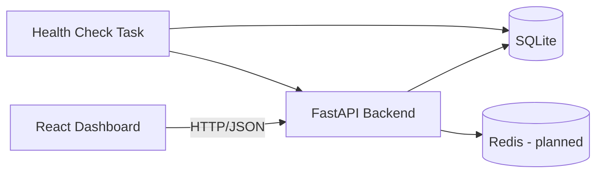
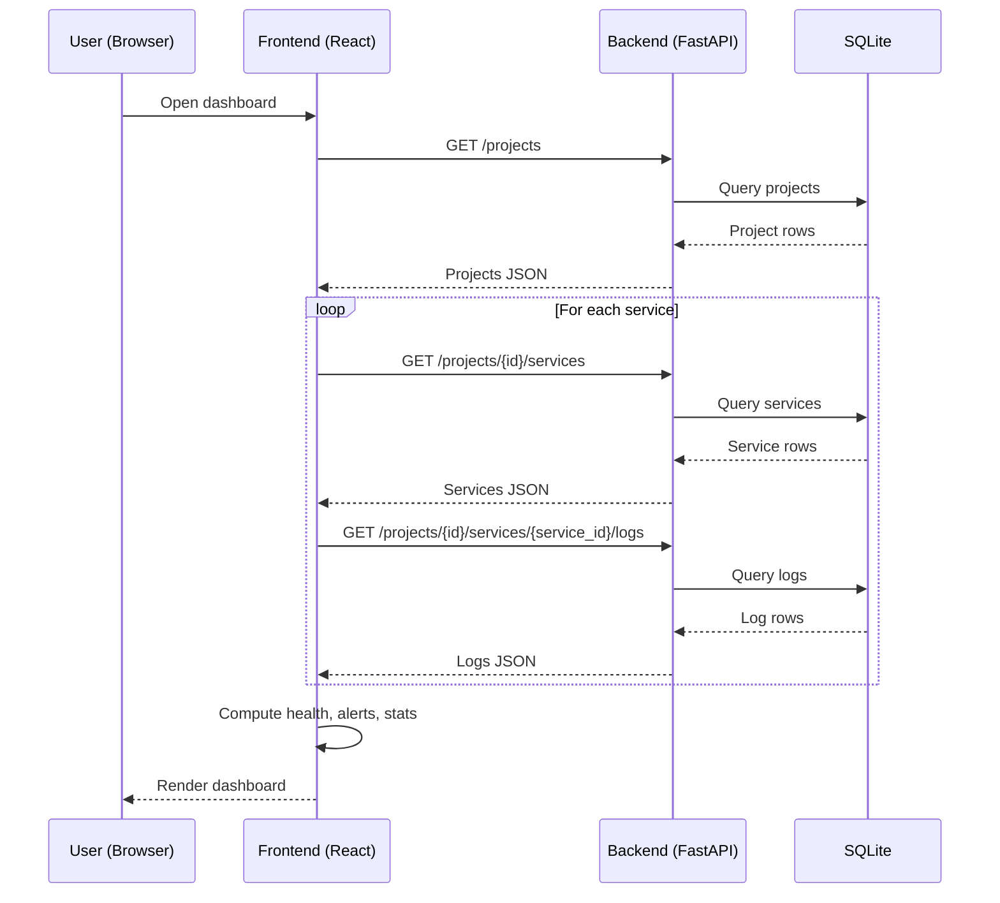

# API Monitoring Dashboard - Architecture

## 1. Project Overview
This project is a lightweight API monitoring platform.

Core capabilities:
- User authentication
- Project management
- Service/API registration per project
- Periodic health-check log ingestion
- Dashboard metrics and alert visibility

Current stack:
- Frontend: React (Vite)
- Backend: FastAPI + SQLAlchemy
- Database: SQLite (dev)
- Cache (planned/placeholder): Redis

## 2. High-Level Architecture



Responsibilities:
- React UI renders monitoring data and calls backend endpoints.
- FastAPI owns business logic, validation, auth, and persistence.
- SQLite stores users, projects, services, and logs.
- Health-check task writes service status logs.
- Redis is reserved for caching hot dashboard reads.

## 3. Repository Structure

```text
api-monitoring-dashboard/
  backend/
    app/
      core/        # config, security
      db/          # engine/session/base metadata
      models/      # SQLAlchemy ORM models
      schemas/     # Pydantic request/response models
      routers/     # API route handlers
      services/    # domain services (monitor/stats)
      tasks/       # background health-check logic
      redis/       # cache integration
      main.py      # FastAPI app entrypoint
  frontend/
    src/
      App.jsx      # dashboard UI + API integration
      App.css      # dashboard styling
      main.jsx     # app bootstrap
```

## 4. Backend Architecture

### 4.1 Layers
- Router layer: HTTP endpoints and request handling
- Schema layer: Input/output validation and serialization
- Model layer: ORM entities and table mapping
- Core layer: Auth/security and runtime config
- DB layer: SQLAlchemy engine/session/base

### 4.2 Data Model
Entity relationships:
- User 1..* Project
- Project 1..* Service
- Service 1..* Log

Key purpose:
- `User`: account and ownership
- `Project`: logical grouping of monitored APIs
- `Service`: monitor target metadata (URL/method/status)
- `Log`: time-series check results (status code, latency, success, message)

### 4.3 API Design (current)
- `POST /auth/register`
- `POST /auth/login`
- `GET /auth/me`
- `POST /projects`
- `GET /projects`
- `GET /projects/{project_id}`
- `PATCH /projects/{project_id}`
- `DELETE /projects/{project_id}`
- `POST /projects/{project_id}/services`
- `GET /projects/{project_id}/services`
- `GET /projects/{project_id}/services/{service_id}`
- `PATCH /projects/{project_id}/services/{service_id}`
- `DELETE /projects/{project_id}/services/{service_id}`
- `POST /projects/{project_id}/services/{service_id}/logs`
- `GET /projects/{project_id}/services/{service_id}/logs`

### 4.4 Security
- Passwords are hashed (bcrypt via passlib)
- JWT access tokens are issued on login
- `get_current_user` dependency decodes token and resolves current user

## 5. Frontend Architecture

### 5.1 Dashboard Composition
The frontend uses one dashboard composition in `App.jsx` that:
- Fetches projects/services/logs from backend
- Computes summary stats (uptime, avg latency, incidents, checks/hour)
- Displays service health and recent logs
- Supports local pagination for log table
- Auto-refreshes data every 60 seconds

### 5.2 API Integration
- Base URL uses `VITE_API_URL` (default `http://127.0.0.1:8000`)
- CORS is enabled in backend for local Vite origins

## 6. Runtime Data Flow



## 7. Current Limitations
- SQLite is fine for MVP/dev but limited for scale/concurrency
- Health-check scheduler/task execution is not fully productionized yet
- Projects currently still allow query-based owner assignment in some routes
- No role-based authorization layer yet

## 8. Next Architecture Steps
- Move from SQLite to PostgreSQL for multi-user reliability
- Add Alembic migrations
- Enforce auth-scoped ownership checks in all routers
- Introduce background worker (Celery/RQ/APS) for scheduled checks
- Use Redis for dashboard aggregation caching
- Add observability: structured logs + metrics + tracing

## 9. Local Run

Backend:
```bash
cd backend
pip install -r requirements.txt
uvicorn app.main:app --reload
```

Frontend:
```bash
cd frontend
cp .env.example .env
npm install
npm run dev
```
